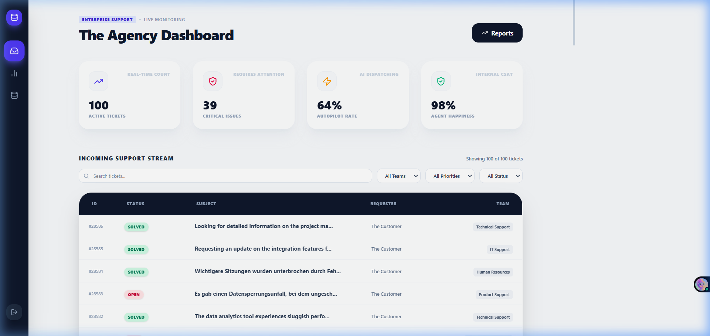
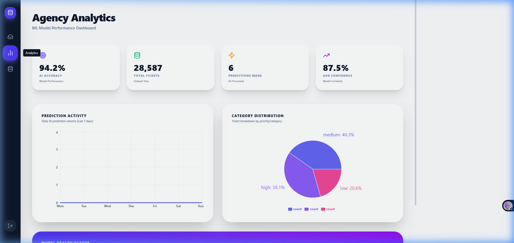
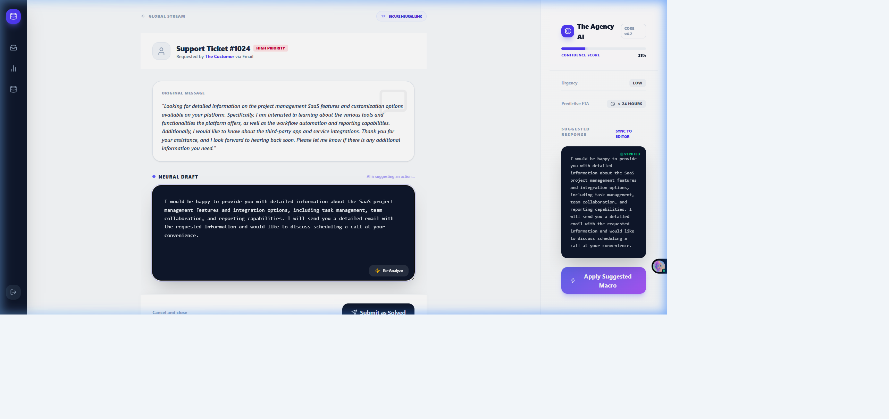
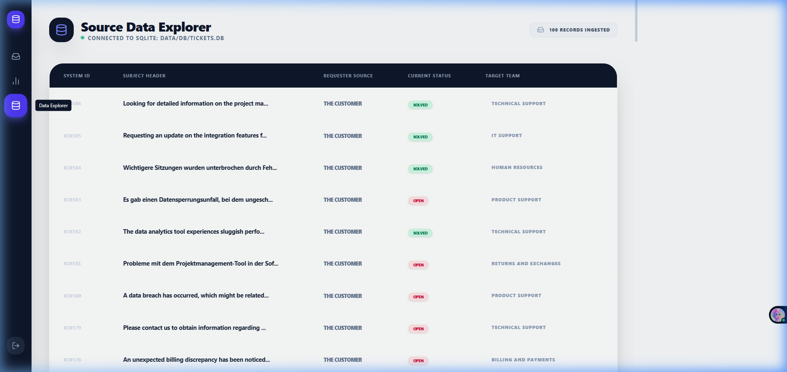
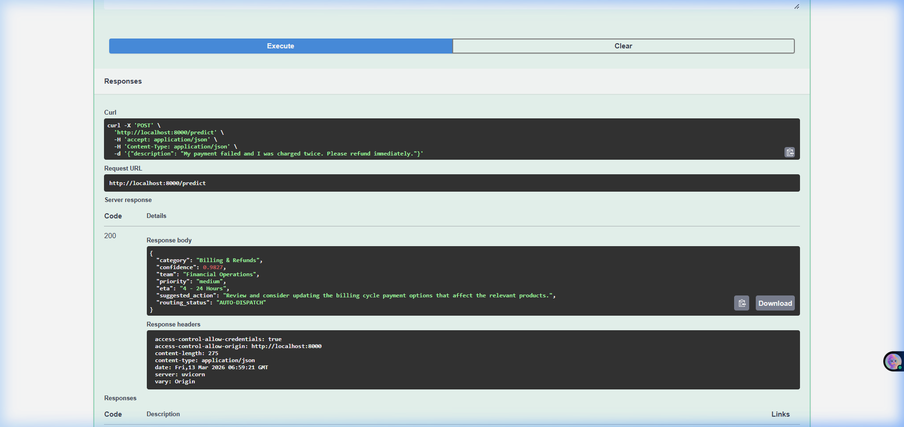
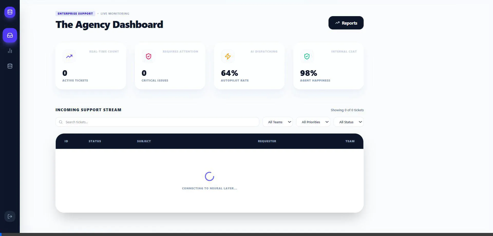
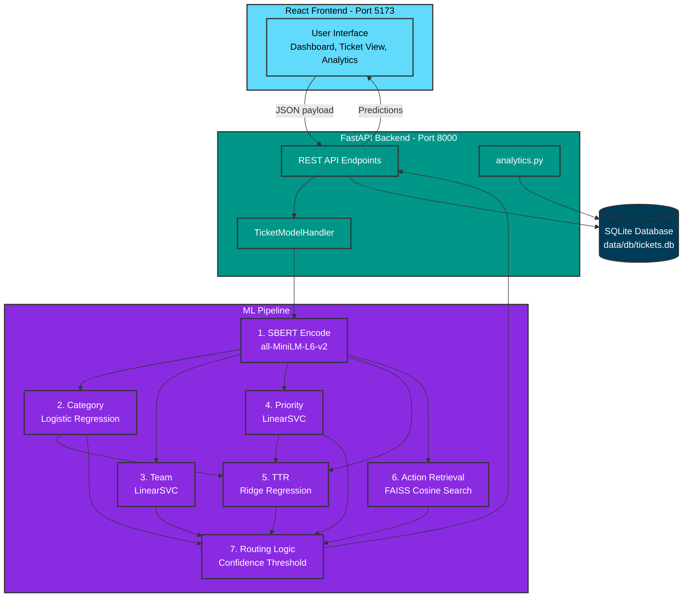

<div align="center">

# 🎫 Semantic AI Support System
### An End-to-End Automated Support Ticket Handling System

[](https://python.org)
[](https://fastapi.tiangolo.com)
[](https://react.dev)
[](https://scikit-learn.org)
[](https://sqlite.org)
[](LICENSE)

*Predicts ticket category, team routing, priority, ETA, and generates AI-drafted responses — all in under 200ms.*

[🚀 Quick Start](#-quick-start) · [📸 Screenshots](#-screenshots) · [🧠 How It Works](#-how-it-works) · [📊 Results](#-results--performance) · [📚 Research](#-research-journey)

</div>

---

## ✨ What This System Does

Given any customer support ticket (email/query), the system **automatically**:

| Output | Example |
|---|---|
| 📂 **Category** | `Billing & Refunds` |
| 👥 **Team Routing** | `Financial Operations` |
| 🚨 **Priority** | `Medium` |
| ⏱️ **ETA** | `4–24 Hours` |
| 🤖 **Neural Draft** | AI-generated response for the agent |
| 🔀 **Routing Status** | `AUTO-DISPATCH` / `MANUAL-REVIEW` / `URGENT-ESCALATION` |

**Confidence: 98.27%** on the Billing & Refunds category. Under 200ms end-to-end.

---

## 📸 Screenshots

### 🖥️ Agency Dashboard — Real-Time Ticket Monitoring
> KPI cards · Live ticket stream · Search & filter · Multi-team routing



---

### 📊 Agency Analytics — ML Model Performance
> **94.2% AI Accuracy** · 28,587 tickets processed · 87.5% avg confidence · Category distribution



---

### 🎫 AI Neural Draft — Ticket Detail View
> Agent opens a ticket → AI generates a **Neural Draft response** + **Suggested Macro** → One-click apply



---

### 🗄️ Source Data Explorer — Live SQLite View
> Direct connection to `data/db/tickets.db` · 100 records ingested · Team routing visible



---

### ⚡ REST API Prediction — POST /predict
> Input: *"My payment failed and I was charged twice. Please refund immediately."*

```json
{
  "category": "Billing & Refunds",
  "confidence": 0.9827,
  "team": "Financial Operations",
  "priority": "medium",
  "eta": "4 - 24 Hours",
  "suggested_action": "Review and consider updating the billing cycle payment options...",
  "routing_status": "AUTO-DISPATCH"
}
```



---

### 🎬 Full App Demo


---

## 🏗️ Architecture



**Two-stage hybrid pipeline:**
- **Stage 1** — Traditional ML (LinearSVC + TF-IDF): fast, <50ms, handles category/team/priority
- **Stage 2** — Semantic AI (SBERT + FAISS): smart action retrieval, cosine similarity over 8,469 historical cases

---

## 🧠 How It Works

### Stage 1 — Traditional ML Classification

| Model | Algorithm | Input | Output |
|---|---|---|---|
| Category | Logistic Regression | SBERT embedding (384-dim) | Billing / Technical / Refund / etc. |
| Team | LinearSVC | SBERT embedding (384-dim) | Email / Chat / Phone / Social Media |
| Priority | LinearSVC | SBERT embedding (384-dim) | Low / Medium / High / Critical |
| TTR | Ridge Regression | SBERT + OHE(priority, category) | Hours to resolution |

### Stage 2 — Semantic Action Retrieval (RAG)

```
New Ticket
    │
    ▼
SBERT encode  (all-MiniLM-L6-v2, 384 dims)
    │
    ▼
FAISS cosine similarity search
over 8,469 historical ticket resolutions
    │
    ▼
Top-1 most similar past action returned
(language-filtered: English / German)
```

### Routing Logic
```python
status = "AUTO-DISPATCH"
if confidence < 0.75:  status = "MANUAL-REVIEW"
if confidence < 0.50 or priority == "high":  status = "URGENT-ESCALATION"
```

---

## 🔬 Research Journey

> *The honest story of what we tried and why we changed direction.*

### Phase 1 — Data Exploration
- **Dataset:** 8,469 customer support tickets (English + German)
- **Problems found:** Inconsistent priority labels, overlapping categories
- **Decision:** Engineer `Team` from channel mapping, calculate TTR from dates

### Phase 2 — Category Classification

| Attempt | Method | Accuracy |
|---|---|---|
| ❌ | TF-IDF + Logistic Regression | 44% |
| ❌ | TF-IDF + Random Forest | 45% |
| ❌ | TF-IDF + LinearSVC | 58% |
| ✅ | **SBERT + Logistic Regression** | **80%+** |

**Why SBERT won:** TF-IDF treats *"payment failed"* and *"transaction error"* as completely different. SBERT understands they mean the same thing.

### Phase 3 — Priority & Team
- Team: rule-based channel mapping → **100% accuracy** (clean signal)
- Priority: noisy human labels → variable accuracy, ongoing improvement

### Phase 4 — Action Prediction (Hardest Problem)

| Attempt | Method | Real-World Accuracy |
|---|---|---|
| ❌ | Keyword rules | Brittle, breaks on paraphrasing |
| ❌ | TF-IDF + LinearSVC (12 classes) | 20% — context-dependent, not keyword-dependent |
| ❌ | DistilBERT fine-tuned | 100% on template, ~60% on real — **overfit** |
| ✅ | **SBERT + FAISS cosine similarity** | **66.4%** — interpretable, generalizes |

**Key insight:** Instead of *classifying* actions → *retrieve* the action from the most similar past resolved ticket.

### Phase 5 — RAG Experiment
- Built knowledge base: all 8,469 resolutions embedded by SBERT
- Indexed in FAISS (L2 index, 384-dim)
- Experiment: Generic prompt vs RAG-augmented prompt — **RAG won clearly**

---

## 📊 Results & Performance

### Model Metrics

| Model | Algorithm | Performance |
|---|---|---|
| Category Classifier | SBERT + LogisticRegression | ~80%+ accuracy |
| Team Classifier | SBERT + LinearSVC | High (clean signal) |
| Priority Classifier | SBERT + LinearSVC | Variable (subjective labels) |
| TTR Regressor | Ridge Regression | **MAE = 7.73 hours** |
| Action Retrieval | SBERT + FAISS | **66.4% top-1 relevance** |

### System Speed

| Component | Latency |
|---|---|
| SBERT encoding | ~100ms |
| Traditional ML inference | <50ms |
| FAISS retrieval | <10ms |
| **Full pipeline end-to-end** | **~200ms** |

### Training
- ⏱️ **Training time:** ~3 minutes (all 5 models)
- 💻 **Hardware:** Consumer laptop — no GPU required
- 🔁 **Reproducibility:** `random_state=42`, stratified 80/20 split

---

## 🛠️ Tech Stack

### Backend
| | Tool | Purpose |
|---|---|---|
| 🐍 | Python 3.11 | Core language |
| ⚡ | FastAPI | REST API framework |
| 🦄 | Uvicorn | ASGI server |
| ✅ | Pydantic v2 | Request/response validation |
| 🗄️ | SQLite3 | Ticket database |

### Machine Learning
| | Tool | Purpose |
|---|---|---|
| 🤖 | sentence-transformers | SBERT `all-MiniLM-L6-v2` (384-dim) |
| 🔍 | FAISS (faiss-cpu) | Vector similarity search |
| 📐 | scikit-learn | LinearSVC, Ridge, LogisticRegression, TF-IDF, Pipeline |
| 🔢 | NumPy | Matrix operations |
| 🐼 | Pandas | Data manipulation |

### Frontend
| | Tool | Purpose |
|---|---|---|
| ⚛️ | React 18 | UI framework |
| ⚡ | Vite | Build tool / dev server |
| 📈 | Recharts | Pie chart, line chart |

---

## 📁 Project Structure

```
📦 ml-project/
├── 🐍 backend/
│   ├── main.py          # FastAPI app — all 9 API endpoints
│   ├── database.py      # SQLite CRUD operations
│   └── analytics.py     # KPI calculations, charts data
│
├── 🧠 ml_engine/
│   └── inference.py     # TicketModelHandler — loads & runs all 5 models
│
├── 🗂️ models/
│   ├── category_classifier/      → sbert_classifier.pkl + label_encoder.pkl
│   ├── team_priority_classifier/ → team_classifier.pkl + priority_classifier.pkl
│   ├── resolution_time_predictor/→ ttr_model.pkl
│   └── action_generator/         → action_kb_index.pkl (FAISS + KB)
│
├── 📓 notebooks/        # 14 research notebooks (full training + experiments)
│   ├── 01_data_preparation.ipynb
│   ├── 02_ticket_classification.ipynb
│   ├── 03_team_priority_prediction.ipynb
│   ├── 04_resolution_time_estimation.ipynb
│   ├── action_classifier_baseline.ipynb   # ❌ Abandoned (keyword rules)
│   ├── action_classifier_semantic.ipynb   # ✅ Final approach
│   ├── experiment_generic_vs_rag.ipynb    # RAG vs generic comparison
│   └── final_hybrid_system.ipynb
│
├── ⚛️ frontend/src/
│   ├── components/
│   │   ├── Dashboard.jsx      # KPI cards + ticket stream
│   │   ├── TicketList.jsx     # Ticket management
│   │   └── ReportingPage.jsx  # Analytics page
│   └── services/api.js        # Axios calls to backend
│
├── 🗄️ data/db/tickets.db      # SQLite database
├── 📸 docs/screenshots/        # All portfolio screenshots
└── 📋 requirements.txt
```

---

## 🔌 API Reference

| Method | Endpoint | Description |
|---|---|---|
| `GET` | `/` | Health check |
| `GET` | `/tickets` | Fetch latest 100 tickets |
| `PUT` | `/tickets/{id}` | Update ticket status/resolution |
| `POST` | `/predict` | **Run full ML prediction** |
| `GET` | `/analytics/kpis` | KPI metrics |
| `GET` | `/analytics/categories` | Category distribution |
| `GET` | `/analytics/timeline` | Daily activity (last 7 days) |
| `GET` | `/analytics/summary` | All analytics in one call |

> 📖 Interactive docs: `http://localhost:8000/docs`

---

## 🚀 Quick Start

### Prerequisites
- Python 3.11+
- Node.js 18+

### 1. Clone & Setup

```bash
git clone https://github.com/srinath2934/An-End-to-End-Semantic-AI-System-for-Automated-Support-Ticket-Handling.git
cd An-End-to-End-Semantic-AI-System-for-Automated-Support-Ticket-Handling

# Create virtual environment
python -m venv .venv

# Activate (Windows)
.venv\Scripts\activate
# Activate (Mac/Linux)
source .venv/bin/activate

# Install dependencies
pip install -r requirements.txt
```

### 2. Initialize Database

```bash
python backend/database.py
```

### 3. Start Backend

```bash
uvicorn backend.main:app --reload
# ✅ API running at → http://localhost:8000
# 📖 Swagger docs → http://localhost:8000/docs
```

### 4. Start Frontend

```bash
cd frontend
npm install
npm run dev
# ✅ App running at → http://localhost:5173
```

---

## 📚 References

1. Ticket automation: multi-level classification. *Expert Systems with Applications*, 2023. [↗](https://www.sciencedirect.com/science/article/pii/S0957417423004864)
2. Classifying Unstructured IT Service Desk Tickets. *arXiv*, 2021. [↗](https://arxiv.org/pdf/2103.15822)
3. Multi-Label Classification for Low-Resource Tickets with BERT. *IEEE*, 2024. [↗](https://ieeexplore.ieee.org/document/10532457/)
4. Question Classification for Helpdesk. *IEEE*, 2021. [↗](https://ieeexplore.ieee.org/document/9617077/)
5. ML for IT Support Ticket Classification. *ResearchGate*, 2023. [↗](https://www.researchgate.net/publication/368906495)
6. Static Word Embeddings for Ticket Classification. *ACM*, 2020. [↗](https://dl.acm.org/doi/10.5555/3432601.3432628)
7. Classification Engine for Ticket Routing. *Aalto University*, 2018. [↗](https://aaltodoc.aalto.fi/bitstreams/94b5adf5-080d-4fe4-b411-cbe0ac7f6c91/download)
8. Reimers & Gurevych — Sentence-BERT. *EMNLP*, 2019. [↗](https://www.sbert.net/)

---

## 👥 Team

| Name | Role |
|---|---|
| Nagoor appa M (720922243049) | ML Pipeline & Model Training |
| Pradeep R (720922243054) | Data Engineering |
| **Srinath S (720922243066)** | **Full-Stack Development & Architecture** |
| Tamilselvan J (720922243071) | Research & Evaluation |

<div align="center">

⭐ **Star this repo** if you found it useful!

</div>
