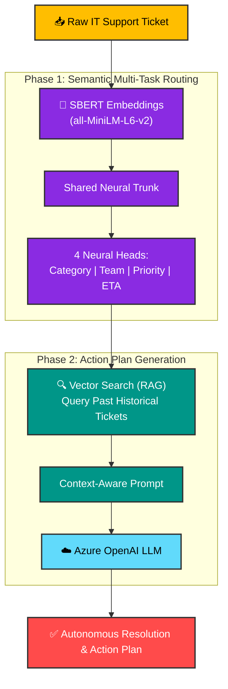
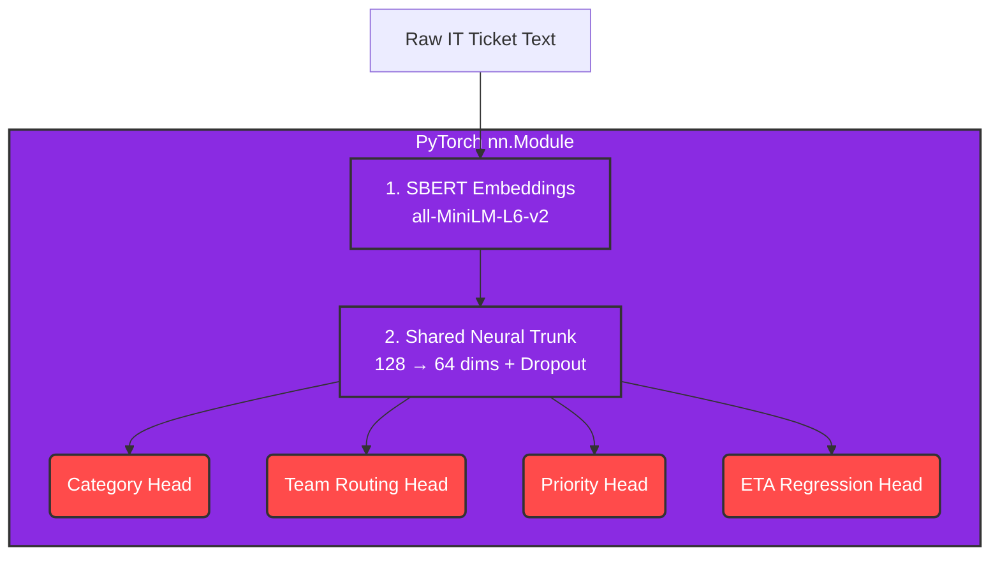

<div align="center">

# 🎫 Semantic AI Driven Multi Task Ticket Routing System Using SBERT Embeddings and Confidence Based Intelligent Automation Framework
### An End-to-End Production Machine Learning System

[](https://pytorch.org/)
[](https://huggingface.co/)
[](https://wandb.ai/)
[](https://fastapi.tiangolo.com)
[](https://react.dev)

*A Full-Stack AI prototype that ingests raw IT tickets and predicts Category, Team, Priority, and ETA simultaneously in under 200ms using a Deep Learning backbone.*

</div>

---

## 💼 The Problem We Are Solving

In large enterprise IT environments, **Level 1 (L1) Support Agents spend up to 30% of their time simply reading and routing tickets** to the correct technical teams. 

This project is a production-grade AI solution designed to eliminate that bottleneck. By deploying a mathematically balanced, highly accurate Deep Learning model, this system:
- **Saves thousands of human hours per week** by auto-dispatching tickets.
- **Prevents SLA Breaches** by instantly flagging high-urgency issues.
- **Reduces Operational Costs** by bypassing L1 triage for standard, predictable requests.

---

## 🚀 The Prototype: Full-Stack Integration

This is a fully functional, production-ready prototype consisting of three major engineering components:



### 1. The High-Concurrency API (FastAPI)
The trained PyTorch weights are loaded into memory via a RESTful FastAPI backend. It exposes a `/predict` endpoint that processes incoming JSON tickets from the company portal and returns the routed team, category, and ETA in less than **200 milliseconds**.

### 2. The Agency Dashboard (React.js)
A real-time frontend dashboard where human IT managers can:
* Monitor Live System Confidence scores.
* View the AI's autonomous routing decisions.
* Intervene or manually override predictions for highly ambiguous tickets.

### 3. The MLOps Pipeline (Weights & Biases)
The massive 500-epoch training loop is strictly monitored using `wandb`. This ensures the AI is not overfitting and guarantees that the system is ready for continuous integration and deployment (CI/CD) as new tickets arrive over time.

---

## 🧠 The Engineering Feat: PyTorch Multi-Task Architecture

To power the SaaS product, I implemented a **Multi-Task Learning (MTL) Neural Network** inspired by modern IEEE research. Instead of building 4 separate models that waste cloud computing costs, this architecture uses a highly efficient **Shared Trunk**.



### The 4 Neural Heads
1. **Category (Classification):** Maps the ticket to one of 15 IT categories.
2. **Team Routing (Classification):** Mathematically routes the ticket to 1 of 6 physical IT teams.
3. **Priority (Classification):** Assesses sentiment and urgency (Low, Medium, High).
4. **ETA (Regression):** Predicts the exact continuous hours required to resolve the ticket.

---

## 📊 Data Engineering: Creating a 108k Balanced Dataset

AI products fail in production if the data is biased. The original dataset provided only contained 48,000 tickets, was missing critical IT classes, and suffered from an 80% imbalance favoring "Priority 0". 

I engineered a mathematically stable dataset to ensure enterprise reliability:

1. **Algorithmic Feature Engineering:** Wrote a sophisticated NLP extraction script to dynamically generate missing IT Teams (e.g., separating `Security Team` from `Network Team` based on semantic context).
2. **Local NLTK Synonym Augmentation:** Used WordNet synonym replacement to artificially generate 52,000 brand-new, context-preserving tickets, bypassing expensive third-party LLM APIs to save costs.
3. **Statistical Upsampling:** Forced the Priority classes into perfect mathematical balance (exactly 36,273 tickets per priority) so the model wouldn't develop lazy bias.

**Result:** A pristine 108,819 row dataset perfectly formatted for PyTorch Dataloaders.

---

## 💻 Technical Resume & Stack

This project demonstrates proficiency across the entire Data Science lifecycle:

* **Language:** Python 3.11, JavaScript
* **Deep Learning:** PyTorch, `torch.nn`
* **NLP Backbone:** HuggingFace Transformers, Sentence-BERT (`all-MiniLM-L6-v2`)
* **MLOps:** Weights & Biases (`wandb`)
* **Data Engineering:** Pandas, NLTK, Scikit-Learn
* **Backend API:** FastAPI, Uvicorn, Pydantic
* **Frontend UI:** React 18, Vite

---

## 🚀 Quick Start (Reproduce the Training)

If you want to train this Multi-Task model locally:

```bash
# 1. Clone the repository
git clone https://github.com/srinath2934/An-End-to-End-Semantic-AI-System-for-Automated-Support-Ticket-Handling.git
cd An-End-to-End-Semantic-AI-System-for-Automated-Support-Ticket-Handling

# 2. Install PyTorch & Dependencies
pip install -r requirements.txt

# 3. Setup your MLOps Environment
# Create a .env file and add your WANDB_API_KEY=your_key_here

# 4. Open the Jupyter Notebooks
cd "New Data Analysis"
jupyter notebook
```
> **Note:** Run `02.1_MTL_Model_Training.ipynb` to kick off the 500-epoch training loop!

<div align="center">
⭐ <strong>From Data Engineering to Deep Learning to Full-Stack Prototype.</strong> ⭐
</div>
