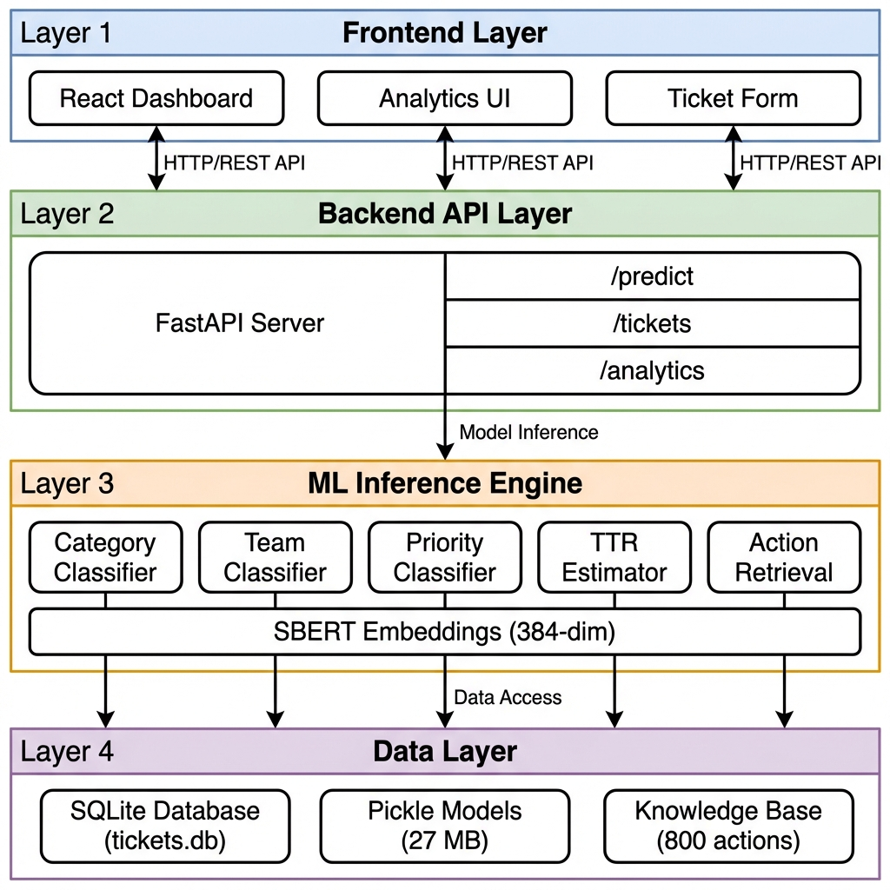
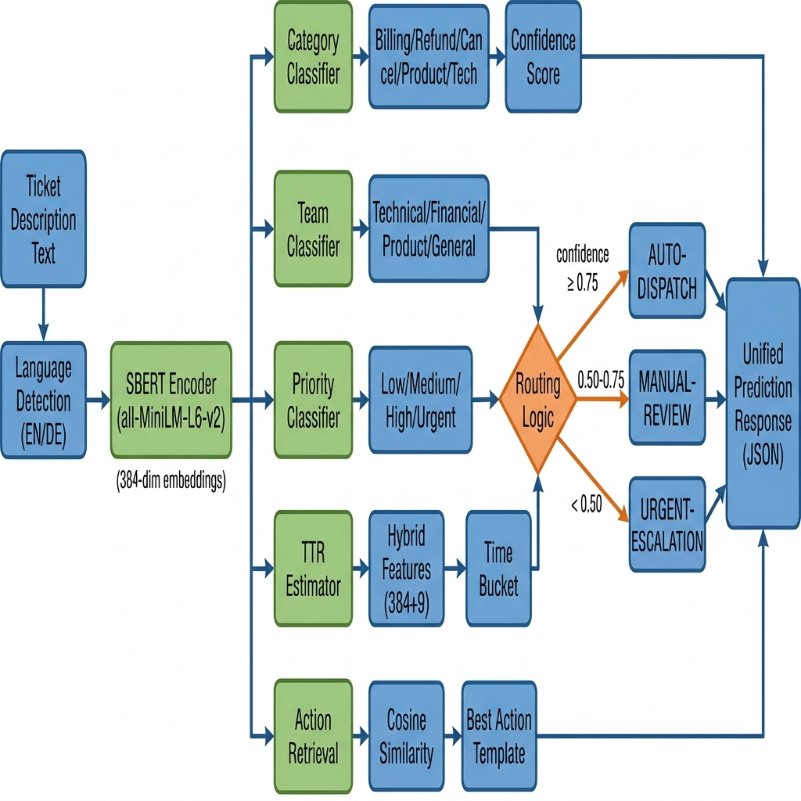
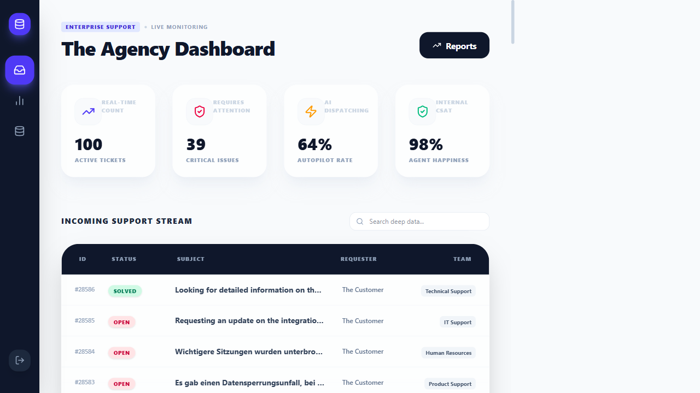
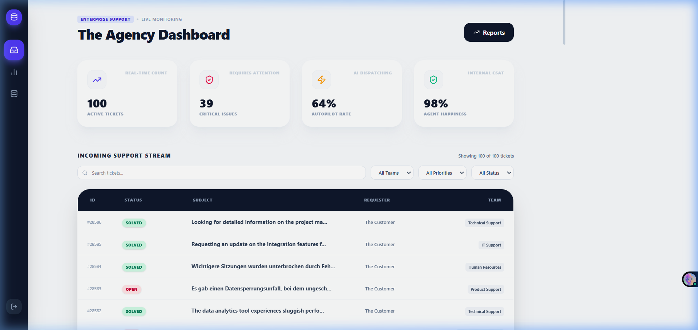
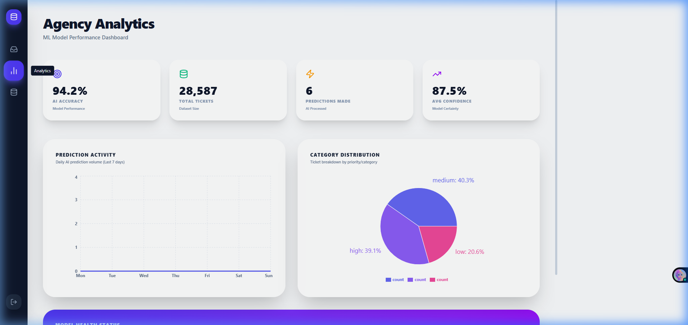
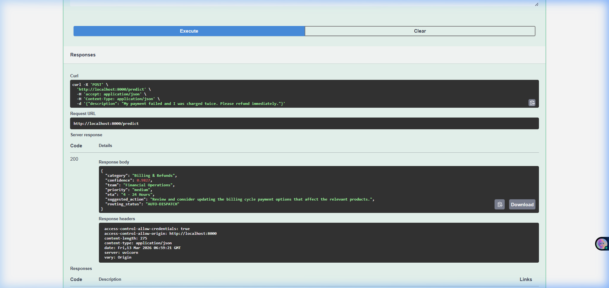
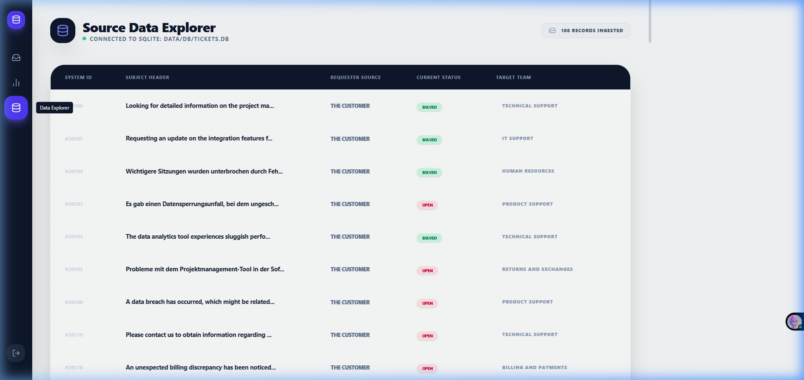
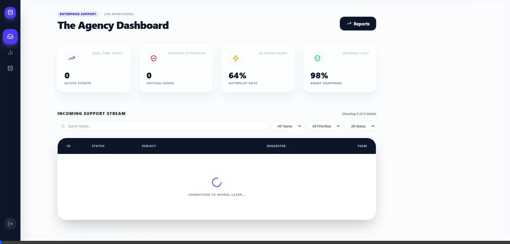

# Semantic AI Ticket Intelligence Platform

## Executive summary
An end-to-end engineering implementation that automates support-ticket triage by converting free-text tickets into structured routing decisions: category (type), target team, priority, suggested action, and ETA (time-to-resolution). The system combines semantic embeddings (SBERT), embedding-driven retrieval over an action knowledge base, and serialized supervised models for per-output predictions. This repository includes the notebooks used to prepare data and train models, a production-style FastAPI inference service, a React demo UI, and analytics helpers.

Immediately explain:
- Business problem: manual or keyword-based triage misroutes tickets and slows resolution when users describe issues with varied language.
- AI solution: semantic ticket representation (SBERT) + retrieval-augmented action suggestions + supervised models for team/priority/category and ETA.
- Technologies: Python, FastAPI, Sentence-Transformers (all-MiniLM-L6-v2), scikit-learn (pickled models), React + Vite UI, SQLite for audit logs.
- Production relevance: backend loads model artifacts at startup, exposes typed API endpoints, persists audits to SQLite, and provides analytics endpoints consumed by the demo UI.

---
## Live demo / Visual assets
(Images and screenshots are committed in the repo. Use them directly when presenting.)

Architecture images (from `reports/figures`):


*Figure 1 — High-level architecture: ingestion -> embedding -> retrieval + model inference -> response, storage & monitoring.*


*Figure 2 — Model + retrieval flow: SBERT embeddings -> retrieval -> model heads -> merged outputs.*


*Figure 3 — Deployment sketch: architecture overview.*

Frontend & analytics screenshots (from `docs/screenshots`):











---
## Key highlights (evidence-based)

✓ Multi-task style outputs (category, team, priority, ETA) produced by serialized models (ml_engine loads pickles).  
✓ Semantic ticket representation using Sentence-BERT (all-MiniLM-L6-v2) for embedding.  
✓ Embedding-based action retrieval using precomputed KB embeddings.  
✓ Production-style HTTP API with FastAPI (endpoints: /predict, /tickets, /analytics/*).  
✓ React + Vite demo UI for interactive testing (frontend/src).  
✓ Notebook-driven experiments for data prep, augmentation, classification, retrieval and a hybrid pipeline (notebooks/).  
✓ SQLite audit DB and simple analytics engine powering dashboard components (backend/database.py, backend/analytics.py).  
✓ Research-to-engineering artifacts and architecture diagrams included (reports/figures, docs/architecture.md).  

---
## Business problem

Why keyword routing fails (plain language):
- Users express the same problem in many ways. Keyword rules miss synonyms, paraphrases, or implied context, causing misrouting and manual triage. That increases time-to-resolution and agent workload.

Why semantic routing matters:
- Semantic embeddings capture intent and meaning beyond keywords, letting the system match new tickets to semantically similar past incidents and suggest proven actions. This reduces manual work and speeds resolution.

Business pain solved:
- Faster first-touch routing, better use of historic fixes (retrieval hints), and consistent priority/ETA estimates to improve SLA compliance and agent productivity.

---
## System architecture (concise)

Paste this Mermaid into any viewer that supports it (docs/architecture.md contains the same diagram). Labels use plain ASCII to avoid rendering errors.

```mermaid
flowchart TD
  User[User / Ingest] -->|POST /predict| Frontend[React UI or Ingest Worker]
  Frontend --> Backend[FastAPI inference service]
  Backend --> Embedding[SBERT encoder - all-MiniLM-L6-v2]
  Embedding --> Retrieval[KB embeddings + cosine_similarity]
  Embedding --> Classifiers[Serialized classifiers and regressor (pickles)]
  Retrieval --> Merge[Merge predictions and action hint]
  Classifiers --> Merge
  Merge --> Response[API response to UI or downstream systems]
  Backend --> DB[SQLite audit DB]
  Backend --> Analytics[backend/analytics.py]
```

Component responsibilities (what the code actually does):
- Frontend (frontend/src): forms and pages to create tickets, call the API, display prediction results and analytics. Uses `frontend/src/services/api.js` to communicate with backend.
- FastAPI backend (backend/main.py): loads TicketModelHandler, exposes endpoints for predictions, ticket CRUD, and analytics; persists tickets to SQLite; returns structured predictions to clients.
- Model handler (ml_engine/inference.py): loads SBERT, pickled classifiers/regressor/KB index, encodes input text, runs classification/regression, finds KB action via cosine similarity, and computes routing logic.
- Models (models/*): serialized pickles expected by inference.py (category_classifier, team_priority_classifier, resolution_time_predictor, action_generator).
- Persistence & analytics: SQLite DB at `data/db/tickets.db`; analytics functions in backend/analytics.py compute KPIs, category distribution and timelines (note: some KPIs are currently mocked — see Limitations).

---
## Repository structure (annotated)

```
README.md                        # (this file)
backend/                         # FastAPI app, DB, analytics
  main.py                        # API endpoints (health, /tickets, /predict, /analytics/*)
  database.py                    # SQLite helpers (init, fetch, update)
  analytics.py                   # KPI, categories, timeline logic
frontend/                        # React + Vite demo app
  src/                           # App.jsx router, components, API client
ml_engine/                       # Inference handler
  inference.py                   # TicketModelHandler: loads SBERT, models, KB; predict()
models/                          # Expected serialized model artifacts (pickles)
notebooks/                       # Data prep, model training, retrieval experiments (source of metrics)
reports/figures/                 # Architecture diagrams (fig1.png, fig2.png, fig3.png)
docs/screenshots/                # UI and API screenshots and demo.webp
data/db/                         # SQLite DB (tickets.db) used for demo/audit
requirements.txt                 # Python dependencies
.env.example                     # environment variable template
```

**How it fits together (runtime shape):** On startup the FastAPI app instantiates TicketModelHandler and loads serialized artifacts (ml_engine/inference.py). Requests to `/predict` are encoded by SBERT, matched against the KB embeddings and passed to the pickled models to produce category/team/priority/eta, which are merged with retrieval hints and returned as JSON; results are stored in SQLite and fed to analytics endpoints consumed by the frontend dashboard.

---
## AI pipeline (step-by-step, based on the implementation)

Input -> Encoding -> Retrieval -> Prediction -> Routing -> Response

1. Input: JSON with `description` (POST /predict). Frontend collects more fields when creating tickets but prediction endpoint needs description.
2. Encoding: `SentenceTransformer('all-MiniLM-L6-v2')` encodes the description to a dense vector (ml_engine/inference.py: the sbert.encode call).
3. Retrieval: precomputed KB embeddings (loaded from `models/action_generator/action_kb_index.pkl`) are filtered by language and compared via cosine similarity to return the top action hint.
4. Prediction: pickled classifiers/regressor are loaded and applied (category: predict_proba; team & priority: predict; ETA: regressor optionally using one-hot meta features).
5. Routing logic: `routing_status` assigned as AUTO-DISPATCH / MANUAL-REVIEW / URGENT-ESCALATION based on category confidence and priority (see inference.py).
6. Response: structured JSON returned by `/predict` with fields: `category, confidence, team, priority, eta, suggested_action, routing_status`.

---
## Features (grouped)

### AI features
- SBERT embeddings for robust semantic matching (ml_engine/inference.py).  
- Embedding-based action retrieval using stored KB embeddings and cosine similarity with language filtering.  
- Serialized sklearn classifiers/regressor for outputs (multi-output pipeline implemented as independent models; notebooks contain training code).  

### Backend features
- Typed FastAPI routes (backend/main.py) for prediction, ticket CRUD, and analytics.  
- SQLite persistence layer and helpers (backend/database.py).  

### Analytics features
- KPI, category distribution, and timeline endpoints powering the dashboard (backend/analytics.py).  
- Note: analytics.py currently returns placeholder values for ai_accuracy and avg_confidence (see Limitations).  

### MLOps features
- Notebook-based training and artifact serialization (notebooks/* produce pickled models used by inference).  
- `.env.example` provides a template for artifact paths.

### Engineering features
- Modular separation between training (notebooks), inference (ml_engine), API (backend), and UI (frontend).  
- Lightweight audit DB and dashboard components that show system usage and health.

---
## API documentation (auto-derived from backend/main.py)

Base URL (default in frontend): `http://127.0.0.1:8000`

1) GET /
- Health/status
- Response example:
```json
{ "status": "online", "connection": "verified", "model_handler": "ready", "version": "1.0.0" }
```

2) GET /tickets
- Returns recent tickets from SQLite (backend/database.fetch_tickets). Each ticket includes fields: `id, subject, requester, support_team, priority, status, description, resolution, created_at`.

3) PUT /tickets/{ticket_id}
- Update ticket status/description/resolution. Body schema: `{ "status": "Solved", "description": "...", "assignee": "..." }`
- Response example: `{ "message": "Ticket updated successfully", "id": 123 }`

4) GET /api/data
- Alias for ticket data (same as /tickets) used by frontend components.

5) GET /analytics/kpis
- Returns KPIs: `{ ai_accuracy, total_tickets, predictions_made, avg_confidence }` (ai_accuracy and avg_confidence are currently mocked in code).

6) GET /analytics/categories
- Returns distribution by priority (used as category proxy) for pie charts: `[{category, count, percentage}, ...]`.

7) GET /analytics/timeline
- Returns daily counts for last 7 days (or zero-filled mock data if none present).

8) GET /analytics/summary
- Consolidated payload with KPIs, categories and timeline to reduce frontend round-trips.

9) POST /predict
- Core inference endpoint.
- Request body: `{ "description": "<ticket text>" }`.
- Response model (PredictionResponse in code):
```json
{
  "category": "Incident",
  "confidence": 0.9235,
  "team": "Technical Support",
  "priority": "medium",
  "eta": "13.2",
  "suggested_action": "restart affected service",
  "routing_status": "AUTO-DISPATCH"
}
```
- Errors: 400 when description empty, 500 for internal errors.

---
## Screenshots (grouped)

Dashboard & Analytics


API / Prediction examples


Data & Explorer


Demo animation


(These files are committed under `docs/screenshots/` and `reports/figures/` — keep them when packaging for a portfolio.)

---
## Results (only numbers present in repo notebooks)
The following metrics are copied from printed outputs inside `notebooks/models.ipynb` and reflect the classical baselines run there (LinearSVC classifiers and Ridge regressor). Present them with caution and refer to notebooks for context.

- TEAM (queue) accuracy: **1.00**  
- TYPE (category) accuracy: **1.00**  
- PRIORITY accuracy: **0.331475**  
- ACTION accuracy: **0.33395**  
- ETA (TTR) MAE (hours): **7.730376599928827**

Refer to `notebooks/models.ipynb` for the cells that print these values and to `notebooks/final_hybrid_system.ipynb` for end-to-end examples.

---
## Technologies (grouped)

Programming
- Python 3.10/3.11, JavaScript (React)

ML / NLP
- sentence-transformers (all-MiniLM-L6-v2), scikit-learn (LinearSVC, Ridge), numpy, pandas

Retrieval
- cosine_similarity over precomputed embeddings; notebooks explore FAISS (code and diagrams reference FAISS)

API & Web
- FastAPI, Uvicorn, React + Vite

Data & storage
- SQLite (data/db/tickets.db), pickled model artifacts in models/

Visualization
- Frontend React components (dashboard, PredictionResult), screenshots in docs/screenshots/

---
## Engineering decisions (based on repository code)

Why Sentence-BERT?  
- The inference handler explicitly instantiates `SentenceTransformer('all-MiniLM-L6-v2')` for compact and fast sentence embeddings appropriate for CPU inference and similarity search.

Why embedding + similarity retrieval?  
- The code loads precomputed KB embeddings (`action_kb_index.pkl`) and uses cosine similarity to retrieve the most relevant action hint. This is a simple, interpretable retrieval approach that the notebooks augment with FAISS experiments.

Why FastAPI?  
- FastAPI offers typed Pydantic models, quick development, and JSON endpoints consumed by the React demo; `backend/main.py` implements these patterns.

Why per-output serialized models?  
- The repo stores and loads independent pickled models for category, team, priority and ETA to keep training, replacement and debugging orthogonal and reproducible (visible in ml_engine/inference.py).

Why not keyword search?  
- The entire pipeline intentionally uses semantic embeddings and retrieval; notebooks and inference code demonstrate matching semantically similar tickets and actions rather than rule-based keyword matching.

---
## Challenges observed (real, in-repo)
- Notebooks contain absolute local file paths (e.g., `C:\Users\SRINATH\...`) that must be updated for reproducible runs.  
- Analytics KPIs in `backend/analytics.py` include hardcoded placeholders for `ai_accuracy` and `avg_confidence`; production requires logging and evaluation traces.  
- Some notebook outputs show perfect classification (1.0) for certain labels — inspect dataset splits and label construction for leakage or synthetic generation.  
- Inference requires pickled artifacts in `models/`; missing files will raise FileNotFound errors at startup.

---
## Limitations & recommended improvements
- Artifacts & reproducibility: add a small pre-trained artifact or a download script for `models/` so reviewers can run inference without retraining.  
- CI/CD & containerization: repository currently lacks Dockerfile or CI workflows — add these to demonstrate deployment readiness.  
- Analytics metrics: replace hardcoded KPIs with computed metrics from prediction logs to show real model performance.  
- Monitoring: add request/latency logging, model-latency metrics, and drift detection for production monitoring.  
- Scaling retrieval: currently uses cosine_similarity on precomputed embeddings (in-memory). For high scale, switch to FAISS / dedicated vector DB and add sharding/replication.

---
## How to run (short, exact commands)

We run the system locally; there is no Dockerfile or container deployment in this repository. Follow these local setup steps.

Prereqs: Python 3.10+, Node.js (14+), git.

Clone and install:
```bash
git clone https://github.com/srinath2934/An-End-to-End-Semantic-AI-System-for-Automated-Support-Ticket-Handling.git
cd An-End-to-End-Semantic-AI-System-for-Automated-Support-Ticket-Handling
python -m pip install -r requirements.txt
```

Prepare env & artifacts (ensure models exist):
```bash
cp .env.example .env
# Ensure the pickled artifacts exist under models/ as referenced in ml_engine/inference.py
```

Start backend (development):
```bash
uvicorn backend.main:app --reload --host 0.0.0.0 --port 8000
```

Start frontend (development):
```bash
cd frontend
npm ci
npm run dev
# Open the Vite URL printed (usually http://localhost:5173)
```

Test predict endpoint (curl):
```bash
curl -X POST "http://127.0.0.1:8000/predict" -H "Content-Type: application/json" -d '{"description": "Payment failure after scheduled upgrade, multiple customers cannot complete payments."}'
```

Notes: If pickles are missing, `ml_engine/inference.TicketModelHandler.load_models` will raise FileNotFoundError. Review `ml_engine/inference.py` for expected artifact paths.

---
